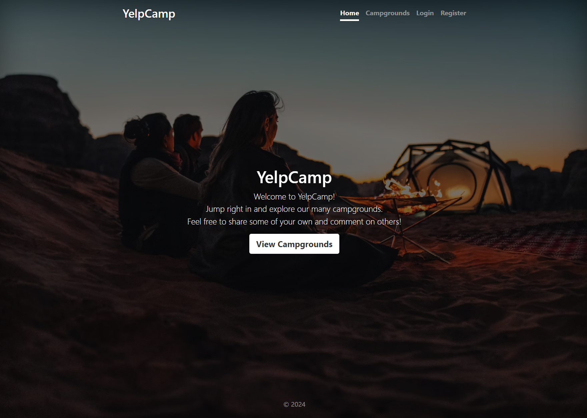

# Yelp Camp



## Table of contents

- [Yelp Camp](#yelp-camp)
  - [Table of contents](#table-of-contents)
  - [Overview](#overview)
    - [The project](#the-project)
    - [Technical Stack](#technical-stack)
    - [Local installation](#local-installation)
    - [Live deployment](#live-deployment)
  - [Future plans](#future-plans)
  - [Acknowledgments](#acknowledgments)

## Overview

### The project

Yelp Camp is a full-stack campground location rating simulator made with JavaScript, Node, Express and MongoDB.

### Technical Stack

Built With

- Frontend
  - JavaScript, [EJS templating](https://ejs.co/)
  - Bootstrap 5
- Backend
  - Node.js
  - Express
- DB
  - MongoDB
  - [Cloudinary](https://cloudinary.com/) (for image storage)
- Geolocation
  - Geoapify
  - [Leaflet](https://leafletjs.com/)
- Authentication
  - [Passport](https://www.npmjs.com/package/passport) Express middleware

### Local installation

If installed locally, the application requires to have a `yelp-camp` database running on MongoDB (more information [here](https://www.mongodb.com/)), as well as Node.js (https://nodejs.org/en).

You will also need to provide your own credentials for connecting to [MongoDB](https://www.mongodb.com/), [Cloudinary](https://cloudinary.com/) and [Geoapify](https://www.geoapify.com/).

1. Install all dependencies :

```
npm install
```

2. Then launch the MongoDB server (locally or from an online cluster).

3. Launch the application in a new terminal :

```
node --watch app.js
```

1. The page will be rendered at `http://127.0.0.1:3000/`.

### Live deployment

On Render at [`https://moulicamp.onrender.com/`.](https://moulicamp.onrender.com/)

## Future plans

- Improve UI (pagination, search bar, etc)
- Add support for passport authentication using Google, Facebook, ...

## Acknowledgments

- Original project idea by [Colt Steele](https://www.udemy.com/course/the-web-developer-bootcamp/)
